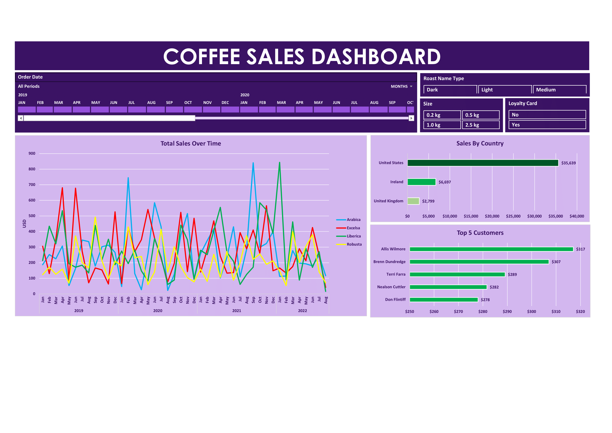

# Coffee-Bean-Sales-Data-Analysis-On-Excel
_**Unlocking Coffee's Hidden Potential - A Journey Through Data**_
- The Coffee Bean Sales Dataset offers a multifaceted exploration of the thriving coffee industry, providing a comprehensive view of sales, customer profiles, and coffee product details. This rich dataset is a gateway to understanding consumer behavior, optimizing product offerings, and improving business strategies in the world of coffee.

## Author
- [@saadharoon27](https://github.com/saadharoon27)

## Table of Contents
- [Business Problem](#business-problem)
- [Data Source](#data-source)
- [Business Problem](#business-problem)
- [Objective, Solution, and Outcome](#objective-solution-and-outcome)
- [Method](#method)
- [Quick Glance At The Dashboard](#quick-glance-at-the-dashboard)
- [Data Overview](#data-overview)
- [Step By Step Changes](#step-by-step-changes)

## Business Problem
**Business Problem Statement:**  
The primary objectives include identifying top customers, tracking coffee-type sales trends, and analyzing sales by country. The dashboard should enable customer engagement and loyalty strategies, optimize product offerings, and support geographical expansion efforts.

## Objective, Solution, and Outcome
**Overall Objectives:**  
- Identify **top 5** customers
- Track coffee-type sales trends for better inventory management.
- Analyze sales by country to aid expansion.

**Solution Requirements:**  
- User-friendly and visually appealing dashboard.
- Interactive visualizations for trend identification.

**Expected Outcomes:**  
The Coffee Sales Dashboard will give actionable insights to boost sales, improve customer satisfaction, and drive strategic expansion efforts.

## Data Source
- [Coffee Beans Sales Dataset](https://www.kaggle.com/datasets/saadharoon27/coffee-bean-sales-raw-dataset)

## Method
- Exploratory data analysis _(EDA)_

## Quick Glance At The Dashboard

## Data Overview
Data on coffee bean sales are divided into 3 separate sheets:
| **Sheet Name**     	            | **Column Names**     |
|-------------------	        |------------------	       |
| **Orders**     	                | Order ID (Primary Key) Order Date Customer ID Product ID Quantity Ordered                                                            |
| **Customers**    	              | Customer ID (Primary Key) Customer Name Email Phone Number Address Line 1 City Country Postcode Loyalty Card         |
| **Products**               	    | Product ID (Primary Key) Coffee Type Roast Type Size Unit Price Price Per 100g Profit 	                                     |

## Step By Step Changes

**Data Gathering and Cleaning:** 
To create a comprehensive table encompassing all details related to product orders, and to enhance the usability of the data for subsequent analysis, various columns from the _Customers_ and _Products_ tables have been combined within the _Orders_ table. These combined columns facilitate a more cohesive representation of the information pertaining to product orders, allowing for more effective analytical processes.

**Columns selected are:**

| **Customers Sheet** |
|-------------------	|
| Customer Name     	|               
| Email    	          |
| Country             |
                                
| **Products Sheet** |
|------------------	 |
| Coffee Type|
| Roast Type |
| Size       |
|Unit Price  |

The techniques employed to retrieve data from the _Customers Table_ involve the utilization of the **VLOOKUP formula**. Meanwhile, a combination of the **INDEX** and **MATCH** functions is applied to extract information from the _Products Table_. This approach ensures that a uniform formula can be adapted and applied across every column within the table, enabling the extraction of data in a consistent manner.

**Column Treatment and Adjustments:**
- 1.	**Email Column:** The missing values in the _Email column_ were replaced with an empty cell using an **IF statement**.
- 2.	**Sales Column:** To populate the _sales column_, a multiplication between _Quantity_ and _Unit Price_ was done
- 3.	**Coffee Type Name Column:** Recognizing that the _Coffee Type column_ exclusively contains abbreviations such as _Rob, Exc, Ara,_ and _Lib_, a supplementary column titled _Coffee Type Name_ has been established. To map the abbreviations to their respective full names, a **Nested IF function** has been implemented. This function systematically converts _"Rob"_ to _"Robusta", "Exc"_ to _"Excelsa"_, _"Ara"_ to _"Arabica"_, and _"Lib"_ to _"Liberica"_, thereby enhancing the comprehensibility of the coffee types.
- 4.	**Roast Type Name Column:** A similar approach was extended to the _Roast Type Name column._ Employing a comparable technique, abbreviations were replaced with their corresponding full roast-type names. Specifically, _"M"_ was transformed to _"Medium"_, _"L"_ denoted _"Light"_, and _"D"_ was indicative of _"Dark"_.
- 5.	**Order Date Column:** To mitigate potential confusion arising from varying date formats across different regions, a strategic adjustment was made. The month component, previously represented as a numeric value, has been transformed into a categorical value.
- 6.	**Size Column:** The _Size column_ lacked metric value notation. As a solution, the unit _"kg"_ was uniformly appended to each row within this column.
- 7.	**Unit Price and Sales Column:** Changed to currency and _$_ symbol was added.
- 8.	**Loyal Card:** Added a new column that checks whether the customer has a loyalty card or not.

**Extra Adjustments**
- Examined for duplicate variables across all columns in the Data Tab, and no instances of duplicate entries were detected. 
- Before moving to plot Pivot charts and tables, a step was taken to convert the entire data range into a table format named _“Orders”_. This transformation holds the advantage of ensuring that any future alterations in the dataset will seamlessly reflect in the pivot table and graphs, eliminating the need for manual adjustments. This dynamic synchronization enhances the efficiency and accuracy of data analysis processes.

**Pivot Table And Dashboard:**
- **Total Sales Sheet:**
  - A pivot table titled _"TotalSales"_ was generated with the purpose of visually representing the aggregate sales across different time periods. However, an issue emerged wherein the data was initially grouped by years. To address this, a modification was made by reorganizing the data into _monthly_ and _yearly_ groups. This adjustment enables more detailed visualization of sales trends over time, facilitating a finer granularity for analysis.
  - Proceeded by adding the _"Coffee Type Name"_ and _"Sales"_ columns to the column list and values respectively of the pivot table. These columns will be utilized along the _Y-axis_ for plotting against the date. This aims to provide insights into the quantity of sales recorded on specific dates, while also considering the different coffee types involved. 
  - Inserted a _2D Line Chart_ and formatted it to my satisfaction.
  - Inserted a Timeline feature from the PivotChart Analyzer. This Timeline tool offers the capability to analyse specific segments of the timeline under consideration. By utilizing this feature, one can dynamically narrow down the timeframe of interest within the pivot chart, thereby enhancing the precision of the analysis and facilitating the exploration of particular time intervals in a more focused manner.
  - Inserted 3 Slicers, _Size, Roast Name Type,_ and _Loyalty Card_.

- **Country Bar Chart Sheet:**
  - Added a new bar graph to represent the countries with the highest sales figures in descending order.
- **Top 5 Customers:**
  - Added a new bar graph and added customer names to the axis category, sorted the whole data in descending order, and then applied the _top 5_ filter.
- **Bar Chart Sheet:**
  - Created a new sheet named _“Dashboard”_, where the interactive visuals will be presented.

Lastly, established connections between all the slicers and the various visual elements present. This linkage ensures that whenever filters are applied through the slicers, the resultant changes are seamlessly reflected across all associated graphs and visual representations.
